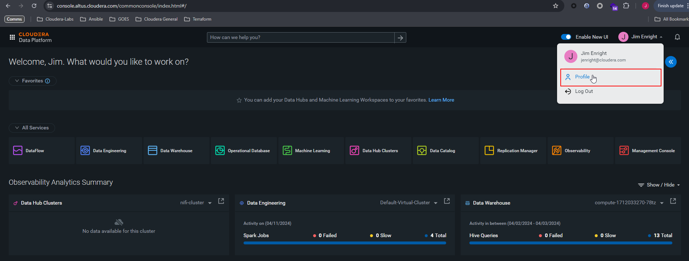
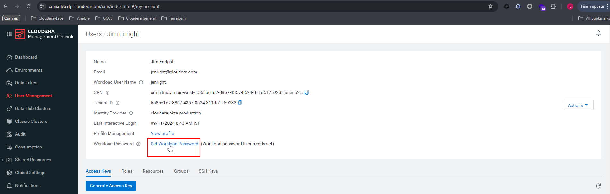
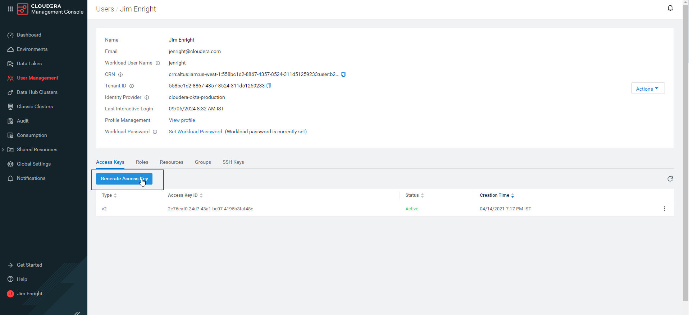

# Cloudera on Cloud Tenant Access Guide

This section guides you through how to generate API access keys and how to set your workload credentials.

## Setting your CDP workload password

Your workload, i.e. FreeIPA, credentials allows access to non-SSO interfaces and APIs within Cloudera on cloud.

Login to the Cloudera on cloud console. Click on your user name and then select `Profile`. Depending on the UI layout your user name is located either in the top right corner (newer UI layout) or bottom left corner (old UI).



On the user profile page, click `Set Workload Password`.



In the dialog box that appears, enter the new workload password twice and click `Set Workload Password`. A message appears saying that the password is set successfully.

Note this password as it will be required to specified in later exercises.

!!! note
    Further details on how to set your workload password are available in the [Setting the workload password](https://docs.cloudera.com/management-console/cloud/user-management/topics/mc-setting-the-ipa-password.html){target="_blank"} documentation page.

## Generating your API access keys

There are two methods available to generate API access keys - via the Cloudera Console UI or via login to the CDP CLI. Select the appropriate tab below for instructions of each method.

### Generate access keys via the Cloudera Console

Login to the Cloudera on cloud console and click on your user name and then select `Profile`. Depending on the UI layout your user name is located either in the top right corner (newer UI layout) or bottom left corner (old UI).


On the user profile page, in the _Access Keys_ tab, click `Generate Access Key`.



In the pop-up window that appears click `Generate Access Key`. The access keypair (id and secret key) will be created and displayed on screen. To use the access keys, you can direct the CDP CLI and SDK to use a _shared credentials_ file or environment variables. 

!!! note
    Further details on how to generate API access keys via the console are available in the [Generating an API access key](https://docs.cloudera.com/cdp-public-cloud/cloud/cli/topics/mc-cli-generating-an-api-access-key.html){target="_blank"} documentation page.
    

### Shared credentials file

The generated access key can placed in a credentials file, by default `~/.cdp/credentials`.

The contents of file can be downloaded when the access key is created; or it can be created/updated via the `cdp configure` CLI command (see [public docs](https://docs.cloudera.com/cdp-public-cloud/cloud/cli/topics/mc-installing-cdp-client.html){target="_blank"}); or it can be manually populated.

```bash title="~/.cdp/credentials"
[<PROFILE_NAME>] # e.g. se_sandbox or default
cdp_access_key_id="an-access-key"
cdp_private_key="a-private-key"
```
    
### Environment Variables

You can provide your credentials via the `CDP_ACCESS_KEY_ID` and `CDP_PRIVATE_KEY`, environment variables, representing your CDP access key id and CDP private key, respectively.

```bash title="Setting environment variables"
export CDP_ACCESS_KEY_ID=$(cdp configure get cdp_access_key_id);
export CDP_PRIVATE_KEY=$(cdp configure get cdp_private_key);
```

