# Lab 2 - Cloudera Data Engineering

In this lab you will get an overview of Cloudera Data Engineering by configuring and deploying a Spark job to prepare the data.

**Goals**

- [ ] Run a data enrichment process
- [ ] Run a process to simulate changes to the data
- [ ] Configure the execution of a pipeline using low-code/no-code tools

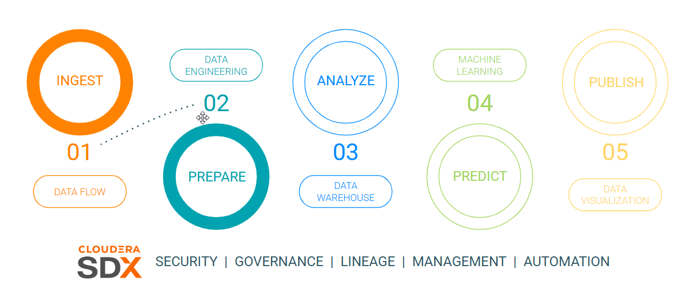

## Requirements

None.

## Tasks

### Open Cloudera Data Engineering

From the Cloudera on cloud Tenant home page, click on Data Engineering.

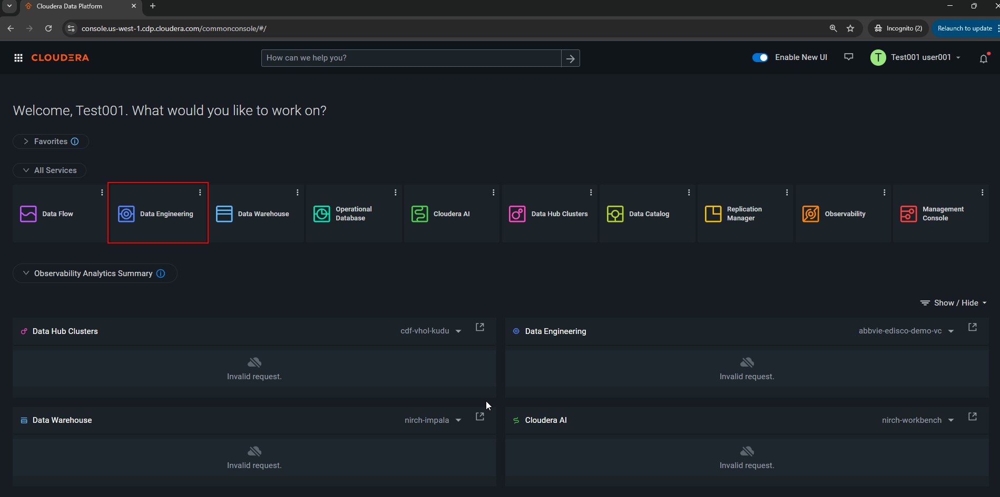

The Data Engineering Home shows all the actions that can be done, such as Jobs in Spark and pipelines in Airflow, Resources and useful information/documentation.

Click on **Jobs** from the left menu to create an Airflow job.

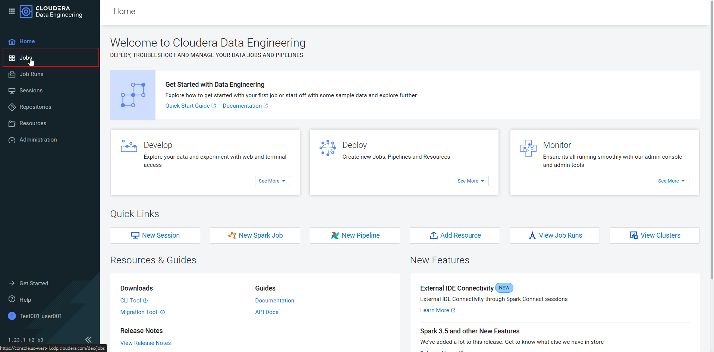

### Create Airflow Jobs

!!! info
    For this workshop, two jobs have been created. We will create an Airflow job which uses both of these.

    * **CDE-updateTable** - generate random changes in rich table to visualize Lakehouse Time Travel functionality.
    * **CDE-telco_data_enrichment** - process in Spark (Python) to enrich the data ingested from Kafka and save to a new table.

In the Job window, ensure that the `{{ cde_virtual_cluster_name }}` Virtual Cluster is selected at the top of the windown. Then click on **Create Job**.

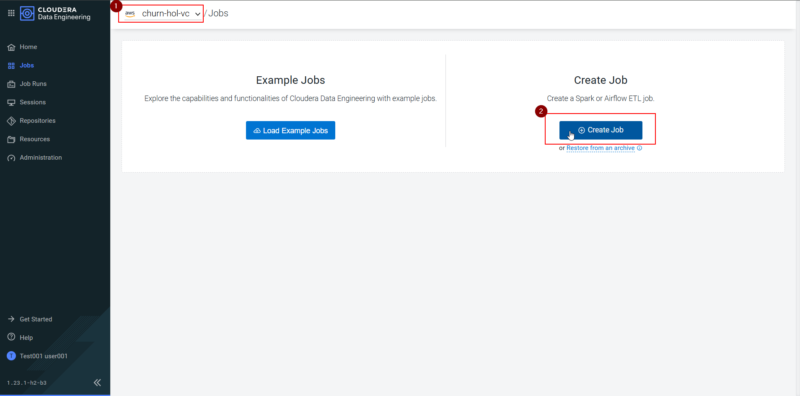

In the Job creation form, enter the following information:

- **Job Type**: Airflow
- **Name**: Use the naming convention `USERNAME-pipeline`.
- **DAG**: Editor, to graphically configure the task.

Click **Create** once these values are correctly entered.

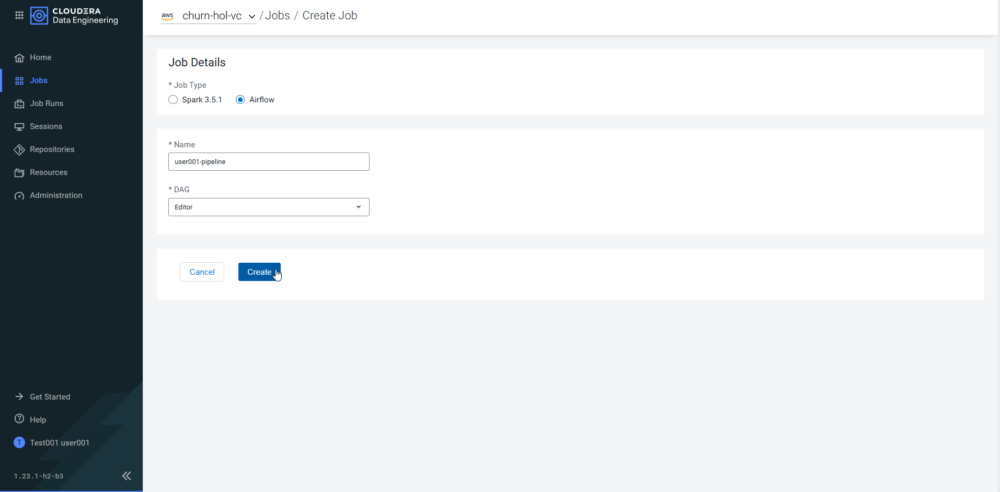

On the Job editing screen, select the **Editor** tab, and you will see the canvas shown in the image below. This can be used to construct the steps of the pipeline. In our case, we are going to create two Cloudera Data Engineering Jobs and relate them.

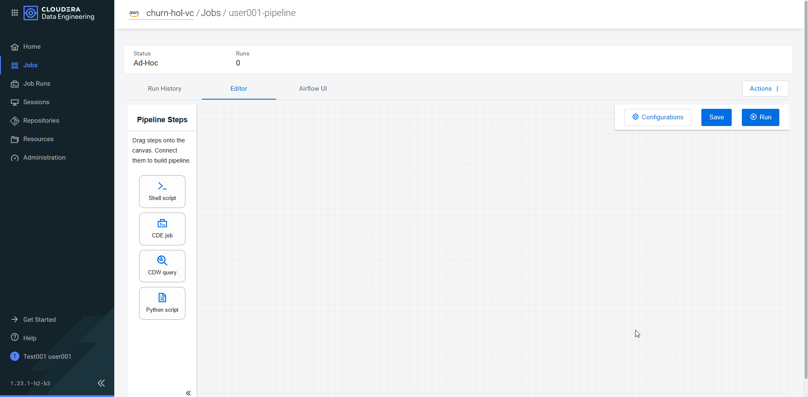

### Configure Data Enrichment job

Let's start with the first Job - Data Enrichment.

Click on the CDE Job button and drag onto the canvas, entering the following settings:

- **Title/Name**: `Data Enrichment`
- **Select Job**: Select `CDE-telco_data_enrichment`
- Check the checkbox **Override Spark values**. Additional options will appear below.
- **Arguments**: Enter your Workload Username, `USERNAME`.

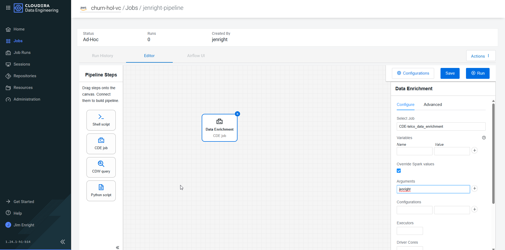

- Click **Save** button.

### Configure Table Update job

Configure the second Job - Table Update.

Click on the CDE Job button and drag onto the canvas, entering
the following settings:

- **Title/Name**: `Table Update`
- **Select Job**: Select `CDE-updateTable`
- Check the checkbox **Override Spark values**. Additional options will appear below.
- **Arguments**: Enter your Workload Username, `USERNAME`.

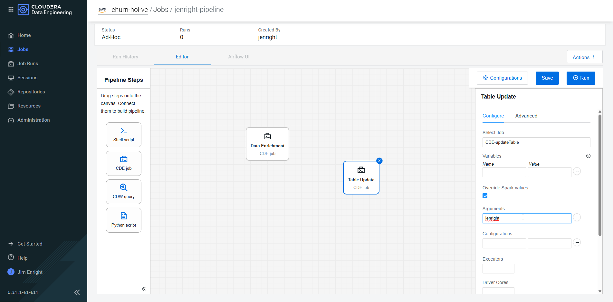

- Click **Save** button.

### Configure Job Execution Squenence

To set up the execution sequence, bind **Data Enrichment** with **Table Update**. For that, click on the right connector of the job of Data Enrichment and drag to the left connector of Table
Update.

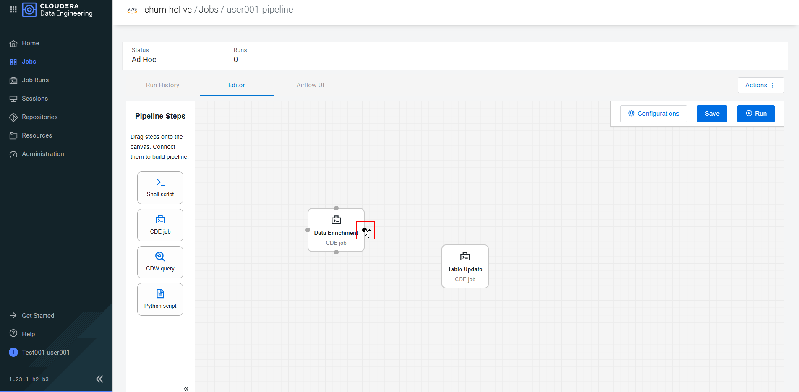

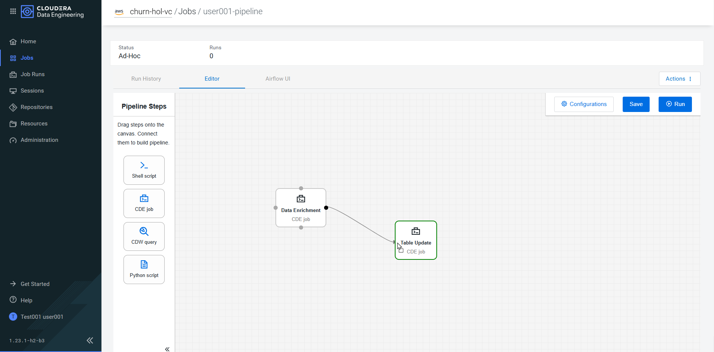

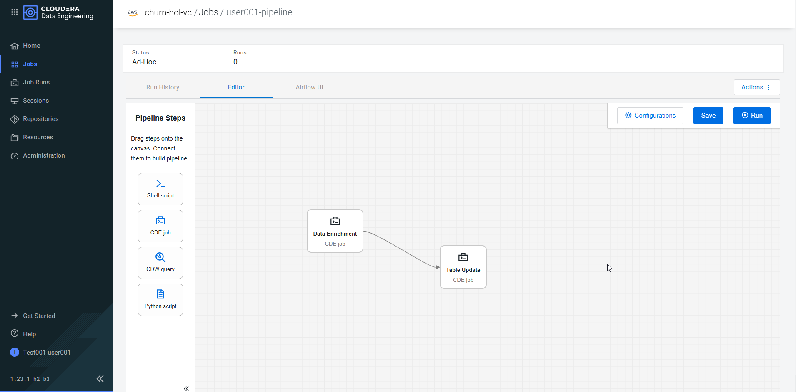

Once the Jobs have been joined, click on **Save** to save the settings made. You should see a message indicating `Pipeline saved to job`.

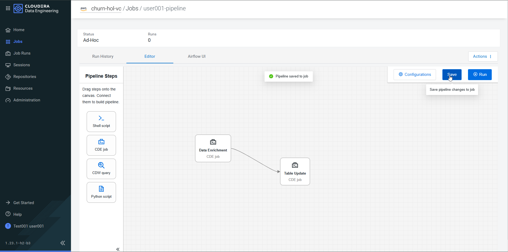

### Run the Airflow Job

We can now run the pipeline.

On the upper right side of the canvas, click **Actions** -> **Run Now**.

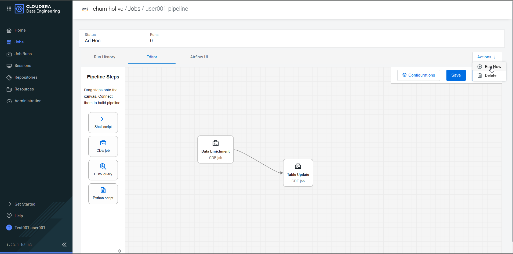

You should see the pipeline execution screen, indicating that the execution has been initialized.

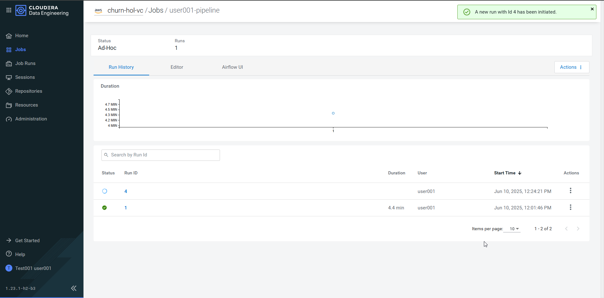

Click on the **Airflow UI** tab to see the execution detail of each step in the pipeline.

The configured Data Enrichment and Table Update jobs are listed at the bottom left. The colors indicating the status of each job. Make sure the radio button **Auto-refresh** is enabled to automatically display the status of jobs.

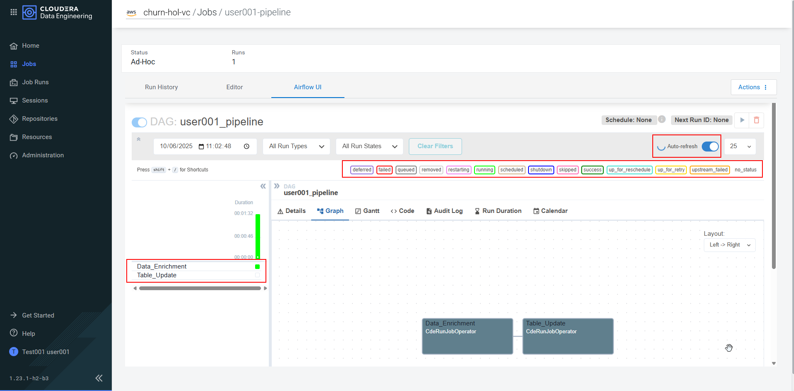

You can see more information about the execution by clicking on the **Graph** view. Hovering the mouse over the Job name displays specific information for each step in the pipeline.

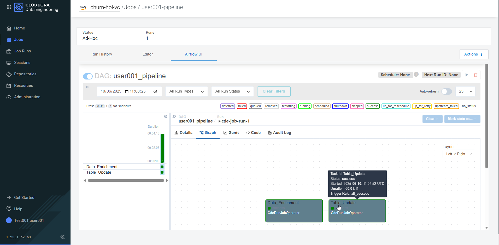

Once both jobs go to status success, make sure the overall pipeline status is success by clicking on the **Details** view. If _Total success_ is 1 the execution was successful.

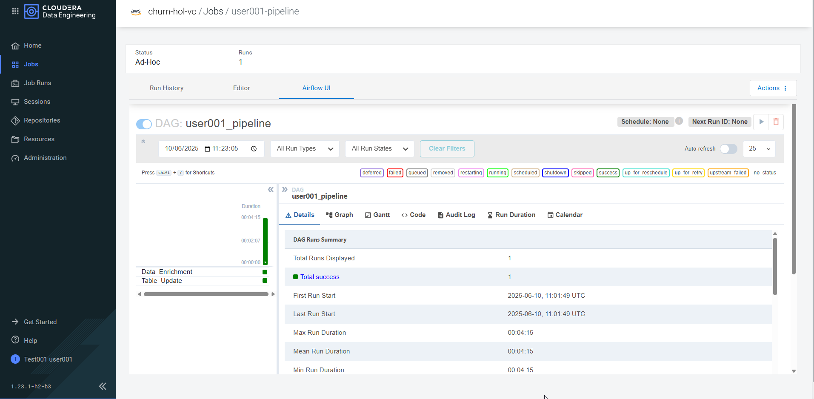

**End of Lab 2**